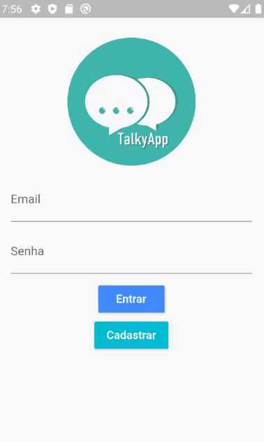
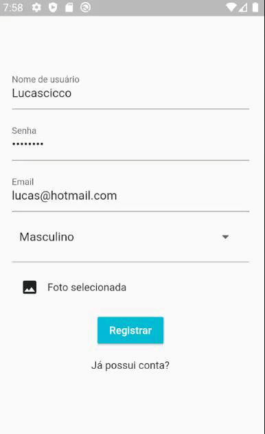
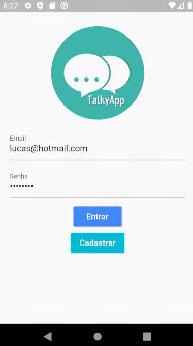
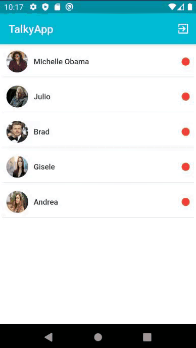
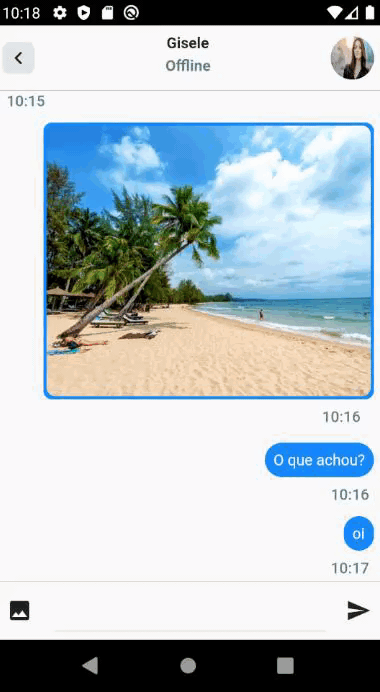

# TALKYAPP CHAT  

É um chat app desenvolvido em Flutter que permite conexão em tempo real através da conexão do back-end com o front-end via socket.io. O aplicativo possui num total de 4 telas: acesso, cadastro, lista de contatos e chat com contato.
A tela de acesso permite o usuário entrar na aplicação, e quando os dados estão corretos, é gerado um token pelo back-end e armazenado pelo shared_preferences dentro do celular. A lista de contatos, é ampla e puxa do back-end todos os usuários disponíveis, exceto o próprio usuário da aplicação, e ao clicar, num perfil, é aberto o chat, e automaticamente é gerado no back-end um ID para aquela "sala de bate-papo". 

As chamadas API's para o back-end são feitas pelo ServiceManager junto com a biblioteca especifíca para isso, http.

It is a chat app developed in Flutter that allows connection in real time by connecting the back-end to the front-end via socket.io. The application has a total of 4 screens: access, registration, contact list and chat with contact.
The access screen allows the user to enter the application, and when the data is correct, a token is generated by the back-end and stored by shared_preferences inside the cell phone. The contact list is wide and pulls all available users from the backend, except the user of the application itself, and when clicking on a profile, the chat is opened, and an ID for that "chat room" is automatically generated inside of the back-end by socket.io.

API calls to the backend are made by ServiceManager along with the specific library for this, http. 

## SCREENSHOTS - CAPTURAS DE TELA

 
    
        
        
    
     
    
        
        
        
    

## WHAT I USED TO DEVELOP IT? O QUE EU USEI PARA DESENVOLVER?

The packages that were used on the application:

Os pacotes que foram usados no aplicativo:

- flutter
- cupertino_icons
- socket_io_client
- shared_preferences
- http
- mobx
- flutter_mobx
- get_it
- scrollable_positioned_list
- file_picker
- photo_view
- http_parser
- image_picker

 

Devolped by, 

Desenvolvido por,

lucascicco

